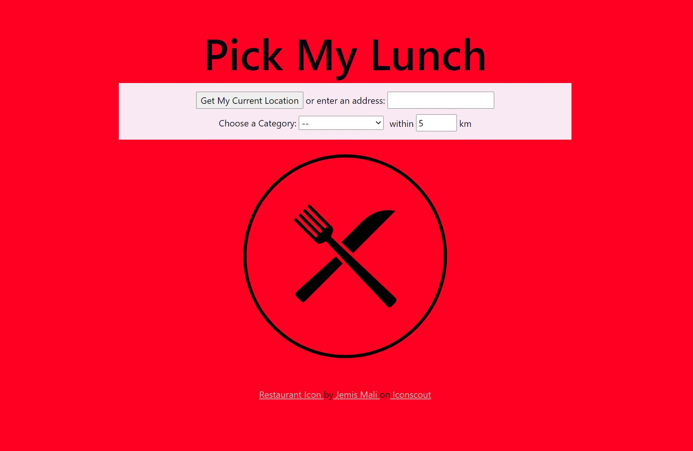

# Pick My Lunch

## About
Simple web application built with **Django** that selects a random restaurant that satisfies a location and (optionally) food category.
<br>
This app makes use of the [Yelp Fusion API](https://www.yelp.ca/developers/documentation/v3/get_started) to retrieve business information.



## Requirements
Clone this repository to run on your local machine.

1. Install Django, [django-environ](https://github.com/joke2k/django-environ), and [requests](https://requests.readthedocs.io/en/master/)
```console
$ pip install django django-environ requests
```

2. Obtain an API Key from [Yelp](https://www.yelp.ca/developers/documentation/v3/authentication)
3. Generate Django Secret Key. You can generate one locally using django.core.management.utils.get_random_secret_key()
```console
$ python -c 'from django.core.management.utils import get_random_secret_key; print(get_random_secret_key())'
```
4. Create a .env file within the lunch_picker directory and copy your API Key and Secret Key into it (use .env.example for a guide)


